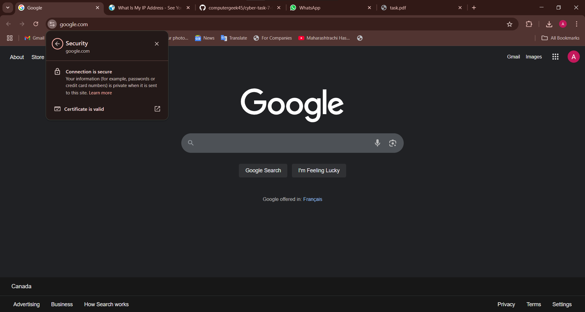
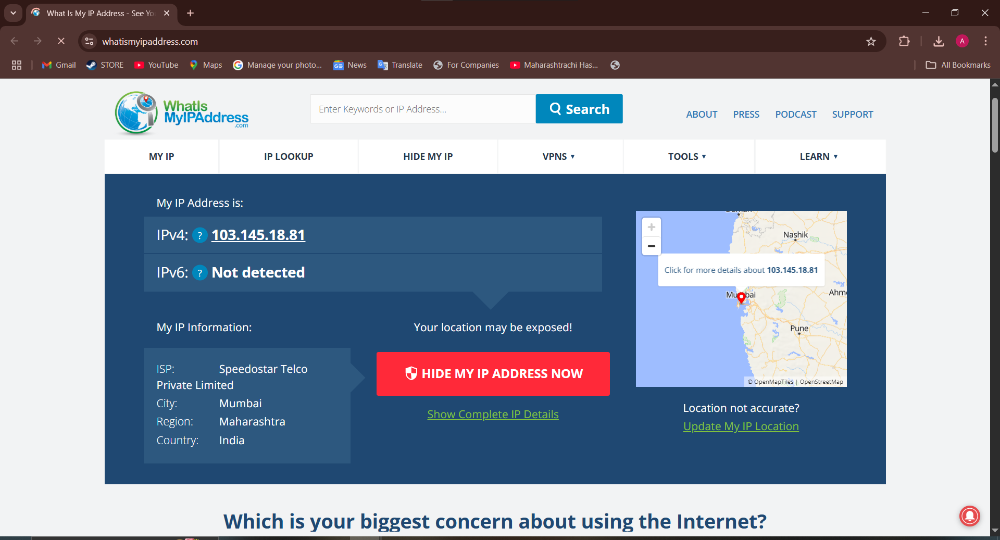

# Cyber Security Internship – Task 8

## Task: Set Up and Analyze VPN Privacy Protection

### Objective:
Understand how VPNs protect online privacy, experience real-time VPN usage, and analyze encryption, IP masking, and performance impact.

---

##  Tools Used:
- **Windscribe VPN (Free Tier)**
- **Google Chrome**
- **https://whatismyipaddress.com**
- **https://google.com**

---

##  Steps Followed:

### 1. VPN Setup
- Chose **Windscribe** as the VPN provider
- Created a free account and installed the Windows app
- Logged in and connected to `Canada West – Toronto (Comfort Zone)`

### 2. Verified VPN Connection
- Visited [whatismyipaddress.com](https://whatismyipaddress.com)
- Observed changed IP: `149.88.98.185`
- New location: **Toronto, Ontario, Canada**
- Screenshot taken: `vpn_connected_toronto.png`

### 3. Verified Traffic Encryption
- Visited `https://google.com`
- Confirmed HTTPS encryption with valid certificate
- Screenshot taken: `vpn_connection_secure_google.png`

### 4. Disconnected VPN & Compared
- Disconnected from Windscribe
- Checked IP again — returned to real IP and location
- Screenshot taken: `vpn_disconnected_ip.png`
- Noticed slightly faster browsing after disconnect

---

## 🔬 Summary: VPN Benefits & Limitations

### Benefits:
- **Masks real IP address**
- **Encrypts data traffic**, protecting against eavesdropping
- Helps maintain **privacy on public Wi-Fi**
- Bypasses regional restrictions in some cases

### Limitations:
- **May reduce browsing speed**
- **Free versions limit server access or data usage**
- **Not completely anonymous** (VPN providers can still log activity unless they have a strict no-log policy)
- Some sites may **block VPN traffic**

---

## What I Learned:
- How VPNs work through encryption and IP tunneling
- Hands-on experience with VPN setup and testing
- The real difference in network identity before and after connection

---

## 📸 Screenshots:

### 🖼️ VPN Connected – Canada IP

### 🖼️ Connection Secure – HTTPS

### 🖼️ VPN Disconnected – Real IP Restored

---

## Final Outcome:
- Successfully used VPN to secure network
- Verified encrypted connection and changed IP
- Gained awareness of VPN limitations
